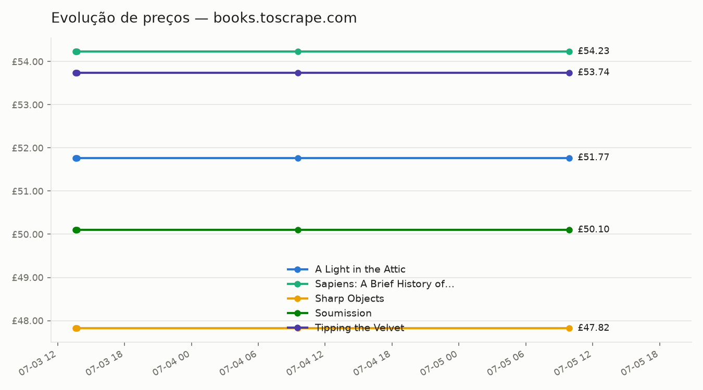
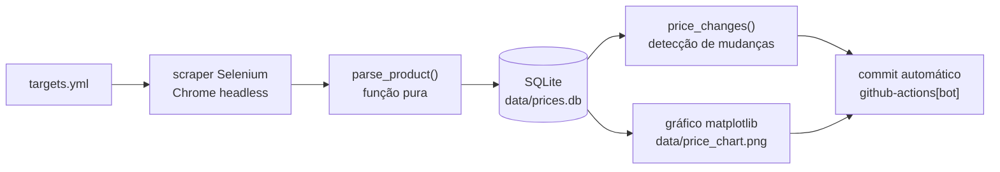

# 📡 price-radar

[](https://github.com/DevTM71/price-radar/actions/workflows/ci.yml)
[](https://github.com/DevTM71/price-radar/actions/workflows/scrape.yml)


Monitor de preços com web scraping (Selenium) que **roda sozinho todos os
dias** via GitHub Actions: coleta os alvos, registra o histórico em SQLite,
detecta mudanças de preço e atualiza o gráfico de evolução. O repositório se
alimenta sozinho — cada rodada entra na `main` como commit automático do bot.



*Este gráfico é o estado vivo do projeto: o workflow diário o regenera e
commita automaticamente a cada execução.*

## Como funciona



```text
src/price_radar/
├── config.py      # Target + load_targets(): lê e valida o targets.yml
├── scraper.py     # Chrome headless + parse_product() pura (testada sem rede)
├── storage.py     # PriceHistory: SQLite puro, Decimal como TEXT, price_changes()
├── report.py      # gráfico matplotlib (backend Agg) e resumo de console
└── __main__.py    # CLI argparse: run / report / chart
```

## Execução agendada

O workflow [`scrape.yml`](.github/workflows/scrape.yml) roda todo dia às
**07:23 UTC** (horário "quebrado" de propósito — cargas em hora cheia entram
em fila no Actions) e:

1. instala as dependências e roda `python -m price_radar run` num runner
   `ubuntu-latest` (Chrome já vem instalado; o Selenium Manager resolve o
   driver sozinho);
2. commita `data/` como **github-actions[bot]**, com a mensagem
   `chore: daily price snapshot [skip ci]` — o `[skip ci]` evita disparar o
   workflow de testes no push do bot;
3. só commita se os dados mudaram, e um grupo de `concurrency` garante que
   nunca há duas execuções simultâneas.

Também dá para disparar manualmente (`workflow_dispatch`): aba **Actions →
Daily scrape → Run workflow**, ou `gh workflow run "Daily scrape"`. Todas as
execuções ficam auditáveis na
[aba Actions](https://github.com/DevTM71/price-radar/actions) — log completo
de cada coleta, rodada a rodada.

## Decisões técnicas

- **Parsing é função pura.** `parse_product(html)` recebe o HTML como string
  e devolve um `ProductSnapshot` — sem rede, sem driver. Os testes cobrem o
  parsing contra uma página real salva em `tests/fixtures/`; nenhum teste
  acessa a rede.
- **Dinheiro nunca é float.** O preço é `Decimal` no domínio e vai para o
  SQLite como TEXT (`"51.77"`): a ida e volta `Decimal → str → Decimal` é
  exata, enquanto float não representa dinheiro. Mesma filosofia da
  [digital-wallet-api](https://github.com/DevTM71/digital-wallet-api).
- **`WebDriverWait`, não sleeps cegos.** A espera pelo carregamento da página
  é por condição explícita (elemento do produto presente), com timeout.
- **Selenium Manager, sem `webdriver-manager`.** A partir do Selenium 4.6 o
  próprio Selenium resolve o driver compatível com o navegador — uma
  dependência a menos.
- **Falha isolada por alvo.** Se um produto falhar, o erro é logado e a
  coleta segue para os demais — uma página fora do ar não derruba a rodada.

## Scraping ético

- O alvo é o [books.toscrape.com](https://books.toscrape.com), site público
  **mantido justamente para prática de scraping**.
- O bot se identifica:
  user-agent `price-radar/1.0 (+github.com/DevTM71/price-radar)`.
- Rate limiting educado: **1,5 s** entre requisições.
- Regras do projeto: não burlar bloqueios, CAPTCHAs ou limites de acesso e
  não coletar dados pessoais.

> [!NOTE]
> **Nota de transparência:** o books.toscrape.com é estático — os preços não
> variam de verdade, então o gráfico mostra linhas constantes. O projeto
> demonstra o **mecanismo completo** de detecção de mudanças, coberto por
> testes com cenários de variação (mudança de preço com delta, preço
> estável, produto com uma única leitura).
> Trocar os alvos no `targets.yml` aponta o radar para qualquer site
> apropriado.

## Rodando localmente

```bash
git clone https://github.com/DevTM71/price-radar.git
cd price-radar
python3 -m venv .venv && source .venv/bin/activate
pip install -r requirements-dev.txt

PYTHONPATH=src python -m price_radar run     # pipeline completo (scraping)
PYTHONPATH=src python -m price_radar report  # só o resumo, sem rede
PYTHONPATH=src python -m price_radar chart   # só o gráfico, sem rede
```

Testes (rápidos e sem rede):

```bash
python -m pytest
```

---

Desenvolvido por [Tiago Martins](https://github.com/DevTM71) — fluxo de
trabalho acelerado por IA com [Claude Code](https://claude.com/claude-code).
